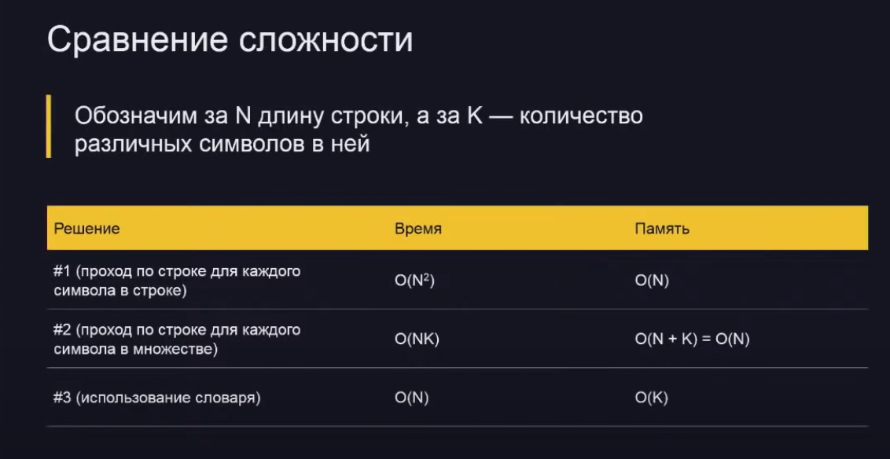

Input:

Дана строка (в кодировке UTF-8) 

Task:

Найти самый часто встречающийся в ней символ. Если несколько символов встречаются одинаково часто то можно вывести любой.

Решение:
1) Resolve1.cpp
2) Resolve2.cpp
3) Resolve3.cpp